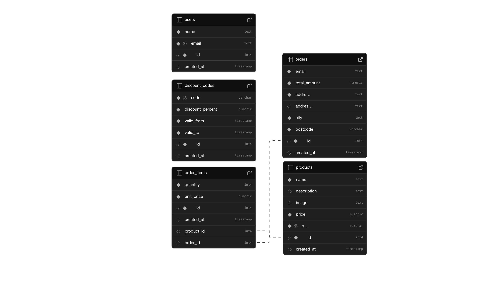

# E-Commerce Platform

A modern e-commerce solution built with Next.js 15, featuring dynamic product mangagement and secure admin portal.

## Quickstart

1. Clone the repository:
```bash
git clone https://github.com/MatthewGarradAda/apa1-supa-task-frontend.git
cd APA1-SUPA-TASK-FRONTEND
```

2. Create a `.env.local` file with:
```env
DATABASE_URL=
NEXT_PUBLIC_SUPABASE_URL=
NEXT_PUBLIC_SUPABASE_ANON_KEY=
```

3. Install dependencies and start:
```bash
npm install
npm run build
npm run start
```

## Technical Stack

- **Frontend**: Next.js 15, React, TypeScript
- **Styling**: Tailwind CSS, Shadcn UI
- **Database**: Supabase with Drizzle ORM
- **Authentication**: Supabase Auth
- **Storage**: Supabase Storage
- **Validation**: Zod
- **Testing**: Vitest, React Testing Library

## Project Structure

```
src/
├── actions/        # Server actions for CRUD operations
├── components/     # React components
│   ├── cart/       # Shopping cart components
│   ├── products/   # Product display components
│   └── ui/         # Shared UI components
├── db/             # Database schema and configurations
├── lib/            # Utility functions
├── app/            # Next.js routes
└── test/           # Test suites
```

## Key Features

### Shopping Experience
- Dynamic product UI
- Persistent shopping cart
- Checkout and confirmation
- Order confirmation emails

### Product Management
- Protected admin routes
- Product CRUD operations
- Upload product images

## Database Schema




## Testing

Comprehensive test suite using Vitest and React Testing Library.

### Running Tests
```bash
npm run test
```

### Test Structure
- Unit tests for utilities and context
- Component tests for critical user paths
- Manual testing using the local environment

## Development

Start the development server:

```bash
npm run dev
```

Visit `http://localhost:3000`
